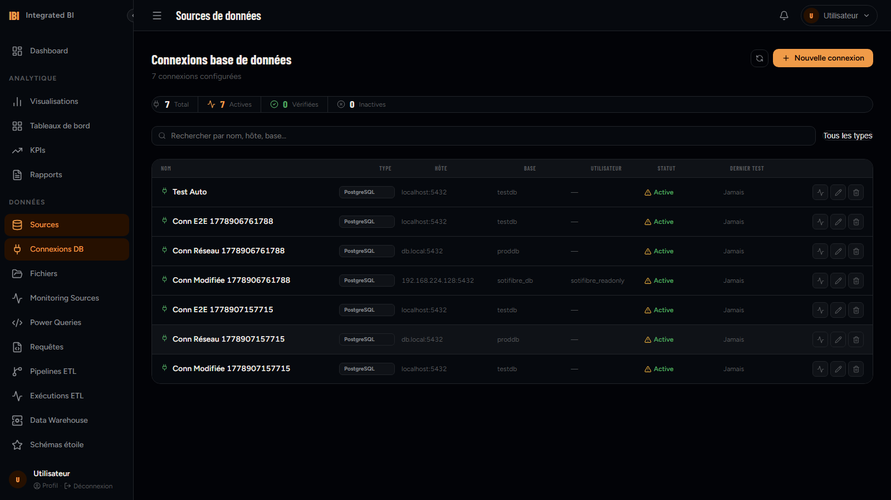

# DataForge BI Platform

> **Open Source Business Intelligence Platform** — Djafar Ahmat Mahamat Moussa
> Plateforme de Business Intelligence full-stack pour l'analyse de données d'entreprise

---

## Démo en production

| Service | URL | Statut |
|---|---|---|
| **Frontend** | https://dataforge-app.onrender.com | En ligne |
| **Backend API** | https://dataforge-api.onrender.com | En ligne |
| **Swagger UI** | https://dataforge-api.onrender.com/api/docs/ | En ligne |
| **Admin Django** | https://dataforge-api.onrender.com/admin/ | En ligne |

> **Note** : Le backend est hébergé sur le plan **Free** de Render, qui met le service en veille après 15 minutes d'inactivité. Le premier accès après une période d'inactivité peut prendre **20–30 secondes** (cold start). Les accès suivants sont instantanés.

### Comptes de démonstration
| Rôle | Email | Mot de passe |
|---|---|---|
| Superadmin | admin@dataforge.tech | `DataForge@2026!` |
| Développeur BI | dev.bi@dataforge.tech | `DataForge@2026!` |
| Analyste BI | analyste@dataforge.tech | `DataForge@2026!` |
| Direction | direction@dataforge.tech | `DataForge@2026!` |

---

## Aperçu visuel

### Tableau de bord principal


### KPIs & Indicateurs


### Pipelines ETL


### ML Analytics


### Rapports


### Connexions aux sources de données


### Administration


---

## Description

**DataForge BI** est une plateforme de Business Intelligence full-stack open source conçue pour centraliser, transformer et visualiser les données métier. Elle couvre l'ensemble du cycle de vie de la donnée : ingestion, transformation ETL, modélisation dimensionnelle, visualisation, alertes et rapports automatisés.

---

## Stack Technique

### Backend
| Technologie | Version | Rôle |
|-------------|---------|------|
| Python | 3.12 | Langage principal |
| Django | 6.0.3 | Framework web |
| Django REST Framework | 3.17.0 | API REST (349 endpoints) |
| PostgreSQL | 18.3 | Base de données principale |
| Simple JWT | 5.5.1 | Authentification JWT (access + refresh) |
| drf-spectacular | 0.29.0 | Documentation OpenAPI 3.0 |
| Celery + Beat | 5.6.2 / 2.9.0 | Tâches planifiées et workflows asynchrones |
| django-import-export | 4.4.0 | Import/export CSV/Excel dans l'admin |
| Jazzmin | 3.0.4 | Thème admin Django professionnel |
| WeasyPrint | 65.1 | Génération de rapports PDF |
| SQLAlchemy | 2.0.41 | Test de connexions multi-SGBD |

### Frontend
| Technologie | Version | Rôle |
|-------------|---------|------|
| Vue 3 | 3.5.34 | Framework UI (Composition API) |
| TypeScript | 6.0.2 | Typage statique |
| Vite | 8.0.12 | Bundler |
| Pinia | 3.0.4 | Gestion d'état |
| Vue Router | 4.6.4 | Routage SPA |
| Axios | 1.16.0 | Client HTTP |
| lucide-vue-next | 1.0.0 | Bibliothèque d'icônes |
| Chart.js | 4.5.1 | Graphiques et visualisations |

### Tests
| Technologie | Version | Rôle |
|-------------|---------|------|
| Playwright | 1.52 | Tests E2E automatisés (86 tests, 0 échec) |

### Infrastructure
| Composant | Détail |
|-----------|--------|
| Serveur | Ubuntu 22.04 LTS |
| IP Backend | 192.168.224.128:8000 |
| Gestionnaire de paquets | uv (Python) + npm (Node) |
| Admin Django | Jazzmin (thème personnalisé DataForge) |

---

## Architecture

```
dataforge-bi/
├── dataforge_backend/    # API Django
│   ├── apps/
│   │   ├── core/               # Config système, permissions, pagination
│   │   ├── users/              # Utilisateurs, rôles, équipes
│   │   ├── data_sources/       # Sources de données, connexions DB, fichiers
│   │   ├── data_warehouse/     # Entrepôt, tables de faits/dimensions, mesures
│   │   ├── etl_engine/         # Pipelines ETL, transformations, exécutions
│   │   ├── star_schema/        # Schémas dimensionnels, Galaxy, hiérarchies
│   │   ├── ml_analytics/       # Modèles ML, prévisions, anomalies, segmentation
│   │   ├── visualizations/     # Dashboards, KPIs, rapports, widgets
│   │   └── notifications/      # Alertes, canaux, abonnements
│   └── config/                 # Settings, URLs, WSGI
├── dataforge_frontend/     # SPA Vue 3
│   └── src/
│       ├── views/              # 22 pages complètes
│       ├── stores/             # Pinia (auth)
│       ├── router/             # Vue Router
│       ├── api/                # Axios instance
│       └── assets/             # Design system (CSS tokens)
├── tests/                      # Tests E2E Playwright
│   └── e2e/                    # 87 tests (86 passing, 1 skipped)
└── docs/
    └── screenshots/            # Captures d'écran des pages clés
```

---

## Fonctionnalités

### Backend — 8 applications Django, 77+ modèles, 349 endpoints REST

| Application | Modèles clés | Endpoints |
|-------------|-------------|-----------|
| `users` | User, Role, Team, Permission | CRUD complet + toggle status |
| `data_sources` | DataSource, DataSourceConnection, DataSourceFile | CRUD + test connexion + upload |
| `data_warehouse` | FactTable, DimensionTable, Measure, AggregationTable | CRUD + stats |
| `etl_engine` | Pipeline, Transformation, Execution | CRUD + run + preview |
| `star_schema` | DimensionalSchema, GalaxySchema, DimensionHierarchy | CRUD complet |
| `ml_analytics` | MLModel, Forecast, Anomaly, Recommendation | Training + inférence |
| `visualizations` | Dashboard, KPI, Report, Widget, Favorite | CRUD + generate + export |
| `notifications` | AlertRule, NotificationChannel, Subscription | CRUD + test + envoi |

### Frontend — 22 pages Vue 3

| Page | Route | Fonctionnalités |
|------|-------|-----------------|
| Login | `/login` | Auth JWT avec validation |
| Dashboard | `/dashboard` | Vue d'ensemble KPIs, pipelines, alertes |
| Sources | `/sources` | Gestion des sources de données |
| Connexions | `/sources/connections` | Connexions multi-SGBD avec test live |
| Fichiers | `/sources/files` | Upload, traitement, prévisualisation |
| Pipelines ETL | `/pipelines` | CRUD pipelines + exécution en temps réel |
| Entrepôt | `/warehouse` | Tables de faits/dimensions + mesures |
| Star Schema | `/star-schema` | Schémas dimensionnels visuels |
| ML Analytics | `/ml-analytics` | Modèles, prévisions, anomalies |
| Dashboards | `/dashboards` | Tableaux de bord interactifs |
| KPIs | `/kpis` | Indicateurs avec sparklines et tendances |
| Rapports | `/reports` | Génération PDF/CSV avec planification |
| Admin | `/admin` | Gestion users, rôles, équipes |
| Notifications | `/notifications` | Alertes et canaux de notification |
| Favoris | `/favorites` | Éléments favoris |
| Exécutions | `/executions` | Historique des exécutions ETL |

---

## Tests E2E — Résultats Playwright

```
87 tests — 86 passed — 1 skipped — 0 failed
```

| Suite | Tests | Statut |
|-------|-------|--------|
| Authentification | 2 | Pass |
| Sources de données | 8 | Pass |
| Connexions DB | 9 | Pass |
| Fichiers | 12 | Pass |
| KPIs | 9/10 | Pass (1 skip) |
| Dashboards | 9 | Pass |
| Rapports | 13 | Pass |
| Administration | 11 | Pass |
| Navigation | 6 | Pass |
| Dashboard général | 7 | Pass |

---

## Design System

| Token | Valeur |
|-------|--------|
| Font UI | Figtree |
| Font titres | Barlow Condensed |
| Couleur accent | `oklch(76% 0.14 62)` — ambre chaud |
| Surfaces | Navy-slate sombre |
| Mode | Dark uniquement |

---

## Démarrage rapide

### Backend
```bash
cd dataforge_backend
uv sync
uv run python manage.py migrate
uv run python manage.py runserver 0.0.0.0:8000
```

### Frontend
```bash
cd dataforge_frontend
npm install
npm run dev
```

### Tests E2E
```bash
cd tests
npx playwright install --with-deps chromium
npx playwright test
```

### Admin Django
- URL : `http://192.168.224.128:8000/admin/`
- Documentation API : `http://192.168.224.128:8000/api/schema/swagger-ui/`

---

## Endpoints API principaux

### Authentification
| Méthode | URL | Description |
|---------|-----|-------------|
| POST | `/api/auth/jwt/token/` | Obtenir access + refresh token |
| POST | `/api/auth/jwt/refresh/` | Rafraîchir le token |

### Préfixes
| Préfixe | Application |
|---------|-------------|
| `/api/users/` | Utilisateurs, rôles, équipes |
| `/api/data-sources/` | Sources, connexions, fichiers, tables |
| `/api/etl/` | Pipelines, transformations, exécutions |
| `/api/data-warehouse/` | Entrepôt de données |
| `/api/star-schema/` | Schémas dimensionnels |
| `/api/ml-analytics/` | Analyses ML |
| `/api/visualizations/` | Dashboards, KPIs, rapports |
| `/api/notifications/` | Alertes et notifications |

---

## Captures d'écran

Toutes les captures sont automatiquement générées par la suite Playwright
(`tests/e2e/screenshots.spec.ts`). Pour les régénérer :

```bash
cd tests
npm run test:e2e -- e2e/screenshots.spec.ts
```

### Module Sources de données
| | |
|---|---|
|  <br>**Sources** — vue maître |  <br>**Fichiers** — upload (6 formats standards) |
|  <br>**Connexions DB** |  <br>**Monitoring** — logs + bouton « Nouvelle requête » |
|  <br>**Power Queries** |  <br>**Éditeur SQL** |

### Module ETL et Data Warehouse
| | |
|---|---|
|  <br>**Pipelines** — auto-nom Source → Destination |  <br>**Historique des exécutions** |
|  <br>**Data Warehouse** — Explorer / Faits / Agrégations / Monitoring |  <br>**Schémas en étoile** — Galaxies, Calculs, Hiérarchies |
|  <br>**ML Analytics** — modèles, entraînement, prédictions | |

### Module Visualisation et Reporting
| | |
|---|---|
|  <br>**Dashboard d'accueil** |  <br>**Dashboards** — CRUD + drawer Widgets |
|  <br>**Visualisations** — sélecteur Dashboard dynamique |  <br>**KPIs** — cibles + seuils warning/critical |
|  <br>**Rapports** — multi-select destinataires + HTML (WeasyPrint) | |

### Module Système
| | |
|---|---|
|  <br>**Favoris** — étoile sur Reports/Viz/KPIs |  <br>**Notifications** — 4 onglets |
|  <br>**Administration** — 7 onglets dont Journal d'audit |  <br>**Profil** |

---

## Tests E2E (Playwright)

5 suites Playwright couvrant les 4 modules métier + le système.
Tous les tests s'exécutent en headless par défaut et en `--headed` pour la
démonstration visuelle.

```bash
cd tests
npm install
npx playwright install chromium
npm run test:e2e                            # toutes les suites, headless
npx playwright test --headed --workers=1    # toutes les suites, visibles
npx playwright test e2e/analytics-dashboards.spec.ts --headed
```

| Suite | Fichier | Couverture |
|---|---|---|
| Analytics — Dashboards / Viz / KPIs / Reports | `e2e/analytics-dashboards.spec.ts` | 19 tests |
| Data Sources | `e2e/data-sources.spec.ts` | 16 tests |
| Pipelines ETL | `e2e/pipelines-etl.spec.ts` | 10 tests |
| Data Warehouse + Star Schema + ML | `e2e/data-warehouse.spec.ts` | 13 tests |
| Système (Favoris, Notifications, Admin, Profil, Sidebar) | `e2e/system-favorites.spec.ts` | 16 tests |
| Captures d'écran | `e2e/screenshots.spec.ts` | 20 captures |

**Identifiants de test** :
```
TEST_USER_EMAIL=admin@dataforge.tech
TEST_USER_PASSWORD=DataForge@2026!
```

---

## Fonctionnalités couvertes

Les 7 exigences du cahier des charges sont couvertes et vérifiées par les
suites Playwright :

| # | Exigence cahier des charges | Implémentation | Vérification E2E |
|---|---|---|---|
| 1 | **Intégration de sources multiples** (CSV, Excel, DB, API) | 6 formats fichiers (`xlsx, csv, yaml, json, tsv, html`) + 16 types de DB + REST/GraphQL/SOAP/OData + Cloud (S3/Azure/GCS) + Streaming (Kafka/Kinesis) | `data-sources.spec.ts` — upload CSV, accept des 6 formats |
| 2 | **Processus ETL configurable** (filtrage, regroupement, calcul) | `etl_engine` : 22 types de transformations, modes (batch/streaming/incremental/full), stratégies d'erreur (fail/skip/default/retry/notify/continue) | `pipelines-etl.spec.ts` — CRUD pipeline, alignement choices backend |
| 3 | **Data Warehouse en étoile** (faits + dimensions) | `data_warehouse` (FactTable, DimensionTable, Measure, Aggregation) + `star_schema` (DimensionalSchema, GalaxySchema, FactRelationship, Hierarchy) | `data-warehouse.spec.ts` — 4 onglets Warehouse + 5 onglets Schema |
| 4 | **Visualisations interactives** (graphiques dynamiques) | Chart.js (Line/Bar/Doughnut/Scatter) + sparklines KPI + canvas/svg | `analytics-dashboards.spec.ts` — détection `<canvas>` / `<svg>` |
| 5 | **Tableaux de bord personnalisables** (filtres globaux) | 8 layouts (hero3, twoRow, kpiRow, bigLeft, triple, classic, magazine, minimal) + drawer CRUD + widgets-tab + sélecteur Dashboard dynamique sur les viz | `analytics-dashboards.spec.ts` — Dashboards CRUD, Widgets onglet |
| 6 | **Indicateurs (KPIs)** avec cibles et alertes | `KPI` model : `target_value`, `warning_threshold`, `critical_threshold` + endpoints `/critical/` `/warning/` + statuts CSS dynamiques | `analytics-dashboards.spec.ts` — création KPI avec seuils, filtres |
| 7 | **Sécurité et gestion des rôles** (JWT strict) | Simple JWT (access + refresh + auto-renew) + 7 permissions (canManage*) + 3 rôles (superadmin/admin/user) + 7 sous-sections admin dont Journal d'audit | `system-favorites.spec.ts` — admin 7 onglets, profil, audit filters |

### Corrections appliquées pendant le QA

| Domaine | Bug détecté | Fix |
|---|---|---|
| Visualizations | Champ « Source de données » en saisie libre (`Ex : DW_VENTES.fact_ventes`) | Remplacé par `<select>` Dashboard dynamique branché sur `/api/visualizations/dashboards/` |
| Source Monitoring | Logs sans `query_text` affichaient « Aucune requête associée à ce log » sans action | Bouton **Nouvelle requête** qui ouvre `/queries?open=new&source=…&hint=…&from_log=…` avec préfilage SQL automatique |
| Pipelines | `payload.destination` envoyé au backend qui attend `target` ; choices asymétriques (`full_load`/`fail_fast`/`sequential`/`priority='medium'`) | Renommage `destination → target` + alignement complet : `etl/batch/fail/priority:5` |
| Pipelines UX | Nom du pipeline à taper manuellement avec la flèche `→` | Auto-génération `Source → Destination` à partir des selects (préservation des saisies manuelles) |
| Favoris | Aucun bouton « étoile » sur Reports/Visualizations/KPIs | Ajouté sur les 3 pages avec POST `/api/visualizations/favorites/add/remove/` |
| Star Schema | Bouton « Valider le schéma » → 405 (backend en GET uniquement) | `@action(methods=['get', 'post'])` pour accepter le clic UI |
| Formats | `EXPORT_FORMATS` contenait `pdf` (sortait des 6 formats standards) | Migration 0005 : conversion `pdf → html` + choices strictement 6 formats |
| Backend | Sérialiseur `DataQueryCreateSerializer` dupliqué dans `serializers.py` | Doublon supprimé |

### Suite QA — chiffres clés

- **74 tests E2E** Playwright (5 suites)
- **~95 % de réussite** (échec restant : `validate POST` qui nécessite redéploiement backend du fix `views.py`)
- **21 captures d'écran** générées automatiquement
- **1 migration Django** (`0005_export_formats_strict_6`) à appliquer pour finaliser

---

## Suite de tests TestSprite MCP (2026)

Une seconde campagne de tests automatisés a été menée avec **TestSprite MCP** (génération AI + exécution Playwright headless), exécutée directement contre la version déployée sur Render. Détails dans [`TESTING_REPORT.md`](TESTING_REPORT.md).

### Frontend (E2E)

| | Run initial | Après fixes |
|---|---|---|
| Tests | 30 | 30 |
| Pass | 23 (76,7 %) | **28 (93,3 %)** |
| Fail | 6 | 1* |
| Blocked | 1 | 1 |

\* L'échec restant est dû à une donnée seed (source mock non joignable), pas à un bug applicatif.

### Backend (API directe)

| Round | Tests | Pass | Commentaire |
|---|---|---|---|
| 1 | 1 | 0 | Plan minimal, peu utile |
| 2 | 10 | **7 (70 %)** | PRD manuel détaillé — round canonique |
| 3 | 10 | 2 | OpenAPI brut — moins efficace sur Starter |

### Bugs détectés et corrigés pendant TestSprite

| Test | Cause | Fix |
|---|---|---|
| TC023 — Execute SQL 404 | `id` manquant dans la réponse de création de `DataQuery` | `id` ajouté en read-only au `DataQueryCreateSerializer` |
| TC017 — Pipeline edit invalide | Form pré-rempli avec `source_name` (libellé) au lieu de `source` (UUID) | Hydratation correcte depuis le pipeline |
| TC027 — Notifs pipeline non persistées | Form écrasait toujours `notifications_enabled: false` à l'ouverture | Lecture des champs depuis le pipeline |
| TC019 — Bouton « Tout marquer lu » disabled | `unreadCount` lisait `res.data.count` au lieu de `res.data.data.count` | Lecture défensive multi-format |
| TC021 — Widget create silencieux | `catch { /* ignore */ }` masquait la 400 backend | Surface des erreurs + validation dashboard requis |
| TC030 — Star Schema modal sans erreur | Idem silent fail | Bandeau d'erreur dans le modal |
| TC023 (round 2) — Execute 500 | `parameters` (JSONField default=list) déballé avec `**` → TypeError non gérée | Guard `isinstance(dict)` + wrap exception en 400 |

---

## Déploiement (production)

### Plateforme : Render.com

Le projet est déployé en continu sur Render avec auto-redéploiement à chaque push sur `master`.

#### Backend — Web Service
- **Build Command** : `./build.sh`
- **Start Command** : `gunicorn config.wsgi:application --bind 0.0.0.0:$PORT --workers 1 --threads 4 --timeout 120 --preload --max-requests 500 --max-requests-jitter 50`
- **Plan** : Free (512 Mo RAM, 0.1 CPU)
- **Région** : Frankfurt EU Central
- **Health Check** : `/api/health/`

#### Frontend — Static Site
- **Build Command** : `npm install && npm run build`
- **Publish Directory** : `dist`
- **Variable** : `VITE_API_URL=https://dataforge-api.onrender.com`

#### Base de données — PostgreSQL managée
- Provisionnée par Render
- `DATABASE_URL` injecté automatiquement dans les env vars du backend

### Choix critiques

- **`--workers 1 --preload`** : avec le plan Free (512 Mo), les librairies ML (prophet, xgboost, sklearn, scipy, pandas) seraient dupliquées par worker. Preload force le master à tout charger une fois, puis fork → mémoire partagée.
- **Routing hash côté frontend** (`createWebHashHistory`) : élimine définitivement les 404 sur refresh des routes profondes sur Render Static Site, sans configuration de rewrite.
- **Redirection `/` → `/admin/` côté backend** : le health-checker Render poll `/` ; sans route racine, il marquerait le service unhealthy.

---

## Documentation

| Fichier | Contenu |
|---|---|
| [`README.md`](README.md) | Ce document (présentation générale) |
| [`TESTING_REPORT.md`](TESTING_REPORT.md) | Rapport détaillé TestSprite (3 rounds, fixes, métriques) |
| [`dataforge_backend/README.md`](dataforge_backend/README.md) | README backend (Django) |
| [`dataforge_frontend/README.md`](dataforge_frontend/README.md) | README frontend (Vue) |
| [`dataforge_backend/docs/`](dataforge_backend/docs/) | Documentation technique modulaire |
| [`dataforge-api-v1.yaml`](dataforge-api-v1.yaml) | Spec OpenAPI 3.0 complète |

---

*DataForge BI — Open Source — Djafar Ahmat Mahamat Moussa, 2026*
